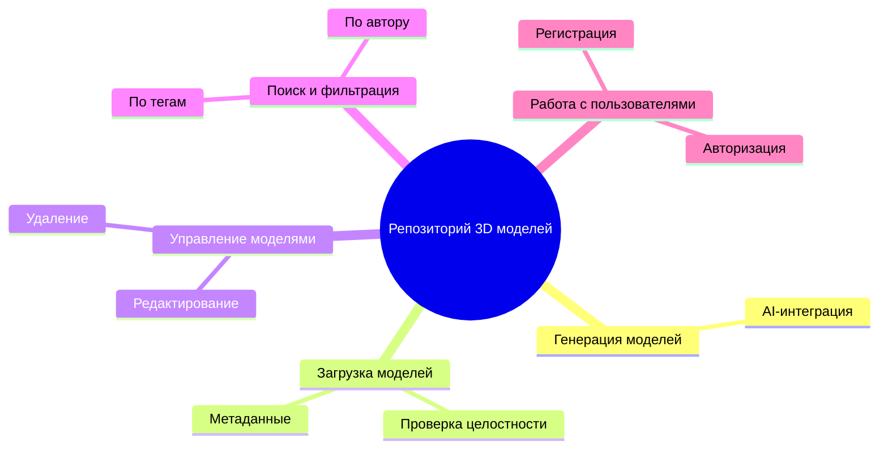
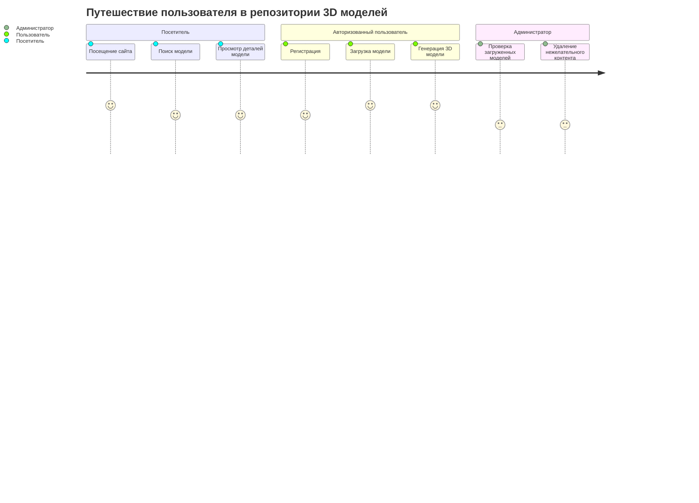
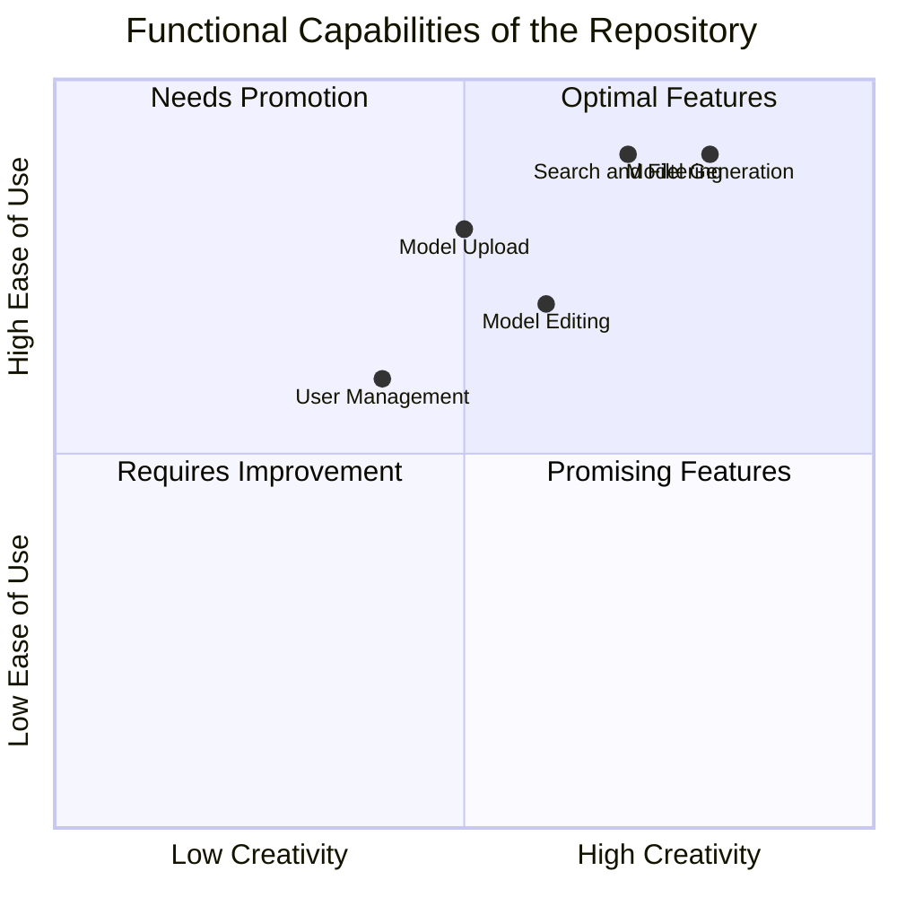
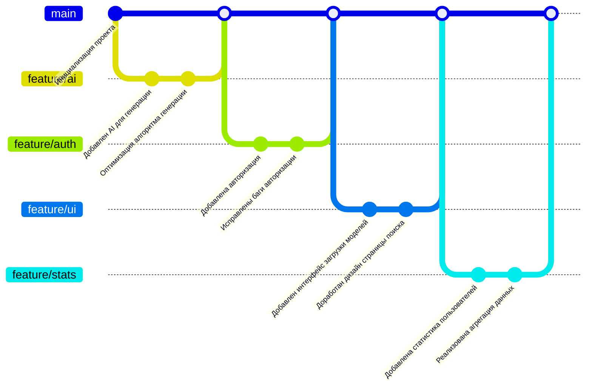

# Информационная система "Электронные визитки"

Информационная система "Репозиторий 3D моделей" позволяет загружать, выгружать, искать и просматривать 3D модели

## 1. Структура функциональных возможностей (Mind Map)

## 2. Диаграмма путешествия пользователя (User Journey Diagram)
Крит путь пользователя. Ииллюстрирует ключевые шаги клиента в процессе использования системы: от входа до завершения заказа.

## 3. Квадрант-граф (Quadrant Chart)

## 4. Git-граф
Отображает историю разработки, включая основные ветки и слияния.

